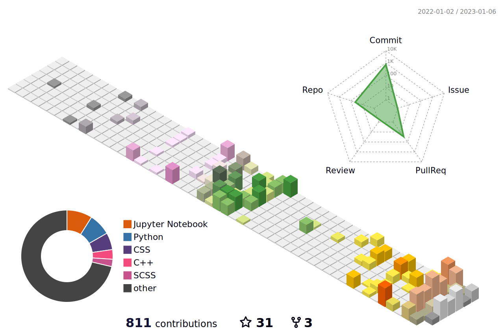

<a href="https://github.com/Anant-mishra1729#gh-dark-mode-only" width = "30">
<!--    -->
  
</a>

  

  

<h1> Let's start with an intro... 
</h1>

  <picture>
  <source media="(prefers-color-scheme: dark)" srcset="https://64.media.tumblr.com/d14995c11b9f3b9c94347e3b5d790d24/babbd570ca3d6c19-f3/s500x750/5fd44a8447f25e68a4da3740b06c65adc597bcea.gif" align="right" width="33%" >
<!--    -->
    
</picture>
  <u>
    <li>:telescope:&ensp;I'm working on <b>Finger Spell</b>, an ISL interpreter. </li>
    <li>:seedling:&ensp; <b>Deep reinforcement learning</b></li>
    <li>🤝&ensp;Looking to collaborate on any pro-bono data science project.</li>
    <li>:heart:&ensp;Stargazing, Chess and <b><a href="https://github.com/Anant-mishra1729/Village-Linux-rice">Ricing Linux</a>
      </b>
    </li>
    <li>:brain:&ensp;For more insights plz checkout my <b>
        <a href="https://anant-mishra1729.github.io/portfolio-site/">Portfolio</a>
      </b>
    </li>
  </u>

<h2>I've worked with </h2>
  
  

  

<h2>Profile summary</h2>
<!-- <table>
  <tbody>
    <tr>
      <td rowspan="3">
        
          
      </td>
      <td>
        <picture>
          <source srcset="https://github-readme-stats.vercel.app/api?username=Anant-mishra1729&show_icons=true&theme=tokyonight&hide_border=true" media="(prefers-color-scheme: dark)" />
          <source srcset="https://github-readme-stats.vercel.app/api?username=Anant-mishra1729&show_icons=true&hide_border=true" media="(prefers-color-scheme: light), (prefers-color-scheme: no-preference)" />
          
        </picture>
      </td>
    </tr>
    <tr>
      <td>
        

        <picture>
          <source media="(prefers-color-scheme: dark)" srcset="https://github-readme-stats.vercel.app/api/top-langs/?username=Anant-mishra1729&layout=compact&theme=tokyonight&langs_count=6&hide=jupyter%20notebook,css">
          
        </picture>
      

      </td>
    </tr>
    <td>
      
  <picture>
          <source media="(prefers-color-scheme: dark)" srcset="https://github-readme-streak-stats.herokuapp.com?user=Anant-mishra1729&theme=tokyonight&hide_border=true">
          
        </picture>
    </td>
  </tbody>
</table> -->
  
<picture>
  <source srcset="https://github-readme-stats.vercel.app/api?username=Anant-mishra1729&show_icons=true&theme=blueberry&hide_border=true&bg_color=1a1d26" media="(prefers-color-scheme: dark)" width = "49%"/>
  <source srcset="https://github-readme-stats.vercel.app/api?username=Anant-mishra1729&show_icons=true" media="(prefers-color-scheme: light), (prefers-color-scheme: no-preference)" width = "49%"/>
  
</picture>
  
<picture>
  <source media="(prefers-color-scheme: dark)" srcset="https://github-readme-streak-stats.herokuapp.com?user=Anant-mishra1729&theme=blueberry&hide_border=true&background=1a1d26" width = "49%">
  
</picture>
<!-- 

   -->

<!--START_SECTION:waka-->
<!--END_SECTION:waka-->

<h2> Contribution history</h2>

  <picture>
    <source media="(prefers-color-scheme: dark)" srcset="profile-3d-contrib/profile-night-view.svg">
    
  </picture>
  

    <h3> ...&ensp;From my diary&ensp;...</h3>
    <i>&nbsp;"Every night in the light of stars, what we see is mostly the obliterated part of this universe..."</i>

 

 

